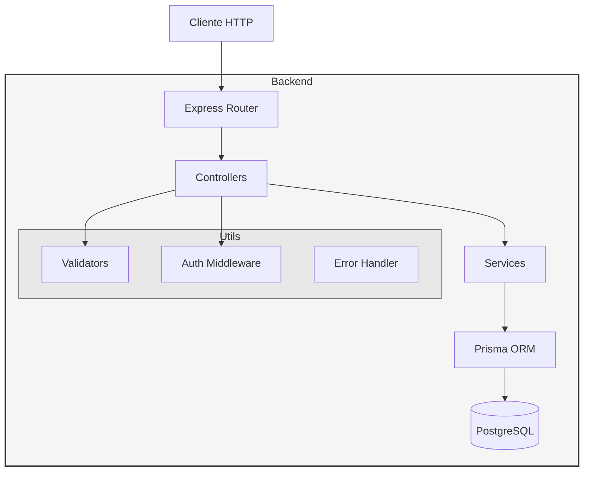

```mermaid
graph TB
    Client[Cliente HTTP] --> Router[Express Router]
    
    subgraph Backend
        Router --> Controllers[Controllers]
        Controllers --> Services[Services]
        Services --> Prisma[Prisma ORM]
        Prisma --> DB[(PostgreSQL)]
        
        Controllers --> Validators[Validators]
        Controllers --> Auth[Auth Middleware]
        
        subgraph Utils
            Validators
            Auth
            ErrorHandler[Error Handler]
        end
    end
    
    style Backend fill:#f5f5f5,stroke:#333,stroke-width:2px
    style Utils fill:#e8e8e8,stroke:#666,stroke-width:1px
``` 