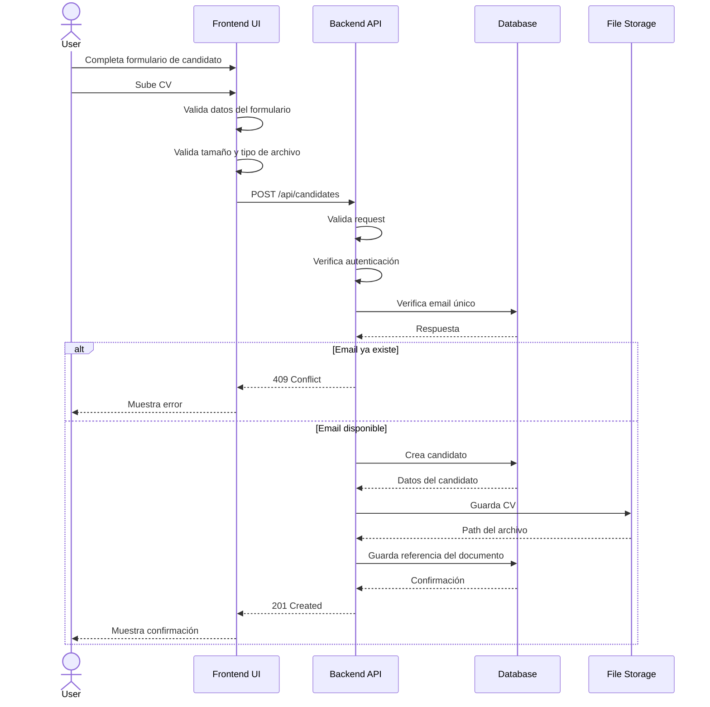

```mermaid
sequenceDiagram
    actor User
    participant UI as Frontend UI
    participant API as Backend API
    participant DB as Database
    participant Storage as File Storage

    User->>UI: Completa formulario de candidato
    User->>UI: Sube CV
    
    UI->>UI: Valida datos del formulario
    UI->>UI: Valida tamaño y tipo de archivo
    
    UI->>API: POST /api/candidates
    
    API->>API: Valida request
    API->>API: Verifica autenticación
    
    API->>DB: Verifica email único
    DB-->>API: Respuesta
    
    alt Email ya existe
        API-->>UI: 409 Conflict
        UI-->>User: Muestra error
    else Email disponible
        API->>DB: Crea candidato
        DB-->>API: Datos del candidato
        
        API->>Storage: Guarda CV
        Storage-->>API: Path del archivo
        
        API->>DB: Guarda referencia del documento
        DB-->>API: Confirmación
        
        API-->>UI: 201 Created
        UI-->>User: Muestra confirmación
    end
``` 