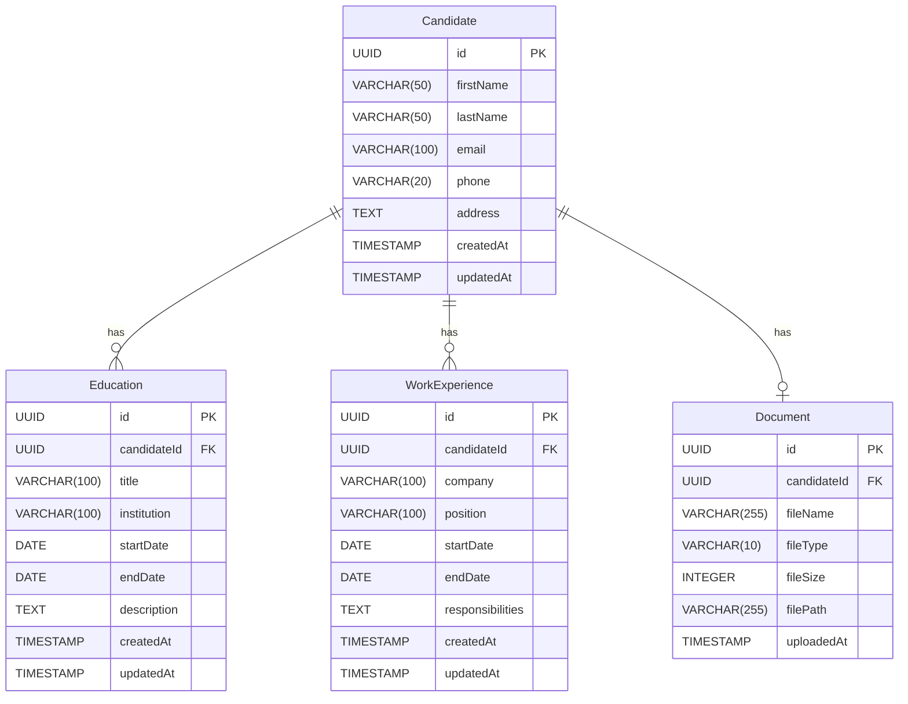

```mermaid
erDiagram
    Candidate ||--o{ Education : has
    Candidate ||--o{ WorkExperience : has
    Candidate ||--o| Document : has

    Candidate {
        UUID id PK
        VARCHAR(50) firstName
        VARCHAR(50) lastName
        VARCHAR(100) email
        VARCHAR(20) phone
        TEXT address
        TIMESTAMP createdAt
        TIMESTAMP updatedAt
    }

    Education {
        UUID id PK
        UUID candidateId FK
        VARCHAR(100) title
        VARCHAR(100) institution
        DATE startDate
        DATE endDate
        TEXT description
        TIMESTAMP createdAt
        TIMESTAMP updatedAt
    }

    WorkExperience {
        UUID id PK
        UUID candidateId FK
        VARCHAR(100) company
        VARCHAR(100) position
        DATE startDate
        DATE endDate
        TEXT responsibilities
        TIMESTAMP createdAt
        TIMESTAMP updatedAt
    }

    Document {
        UUID id PK
        UUID candidateId FK
        VARCHAR(255) fileName
        VARCHAR(10) fileType
        INTEGER fileSize
        VARCHAR(255) filePath
        TIMESTAMP uploadedAt
    }
``` 