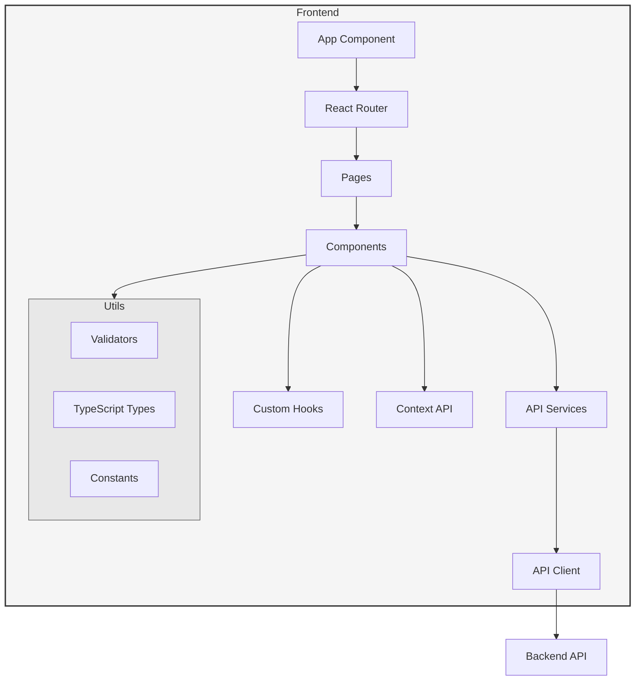

```mermaid
graph TB
    subgraph Frontend
        App[App Component] --> Router[React Router]
        Router --> Pages[Pages]
        
        Pages --> Components[Components]
        Components --> Hooks[Custom Hooks]
        
        Components --> Context[Context API]
        Components --> Services[API Services]
        
        Services --> APIClient[API Client]
        
        subgraph Utils
            Validators[Validators]
            Types[TypeScript Types]
            Constants[Constants]
        end
        
        Components --> Utils
    end
    
    APIClient --> Backend[Backend API]
    
    style Frontend fill:#f5f5f5,stroke:#333,stroke-width:2px
    style Utils fill:#e8e8e8,stroke:#666,stroke-width:1px
``` 