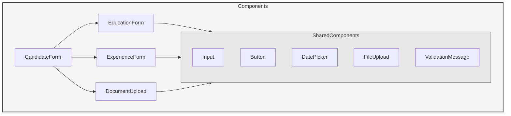

```mermaid
graph TB
    subgraph Components
        CandidateForm[CandidateForm]
        EducationForm[EducationForm]
        ExperienceForm[ExperienceForm]
        DocumentUpload[DocumentUpload]
        
        CandidateForm --> EducationForm
        CandidateForm --> ExperienceForm
        CandidateForm --> DocumentUpload
        
        subgraph SharedComponents
            Input[Input]
            Button[Button]
            DatePicker[DatePicker]
            FileUpload[FileUpload]
            ValidationMessage[ValidationMessage]
        end
        
        EducationForm --> SharedComponents
        ExperienceForm --> SharedComponents
        DocumentUpload --> SharedComponents
    end
    
    style Components fill:#f5f5f5,stroke:#333,stroke-width:2px
    style SharedComponents fill:#e8e8e8,stroke:#666,stroke-width:1px
``` 